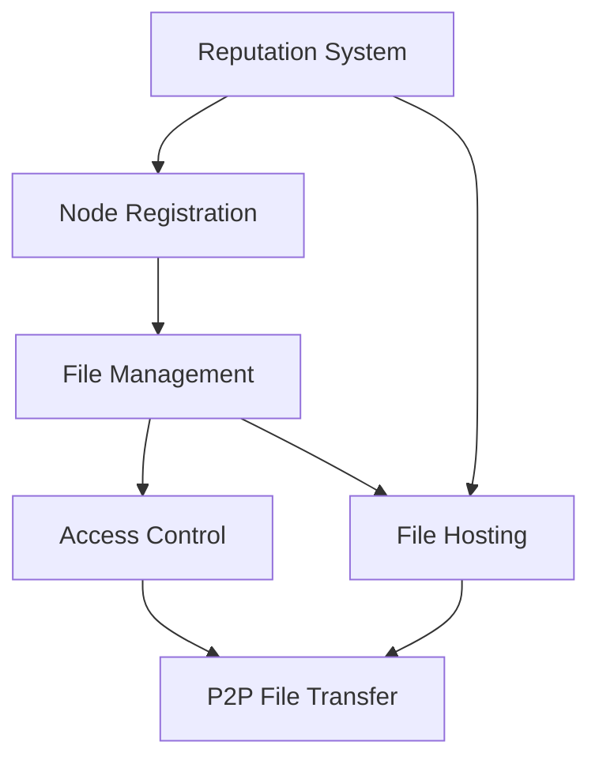

# NodeLink P2P Network

A decentralized peer-to-peer file sharing network built on the Stacks blockchain that enables secure, censorship-resistant file sharing without centralized intermediaries.

## Overview

NodeLink creates a decentralized file sharing ecosystem where users can:
- Register as network nodes
- Share files with verifiable integrity
- Control access permissions
- Build reputation through network participation
- Coordinate peer-to-peer file transfers

The system leverages blockchain technology for metadata storage and access control while enabling direct P2P file transfers between nodes.

## Architecture

The NodeLink network consists of several key components:



### Core Components
1. **Node Registry** - Tracks network participants and their metadata
2. **File Registry** - Stores file metadata and content hashes
3. **Access Control** - Manages file sharing permissions
4. **Hosting System** - Coordinates file availability across nodes
5. **Reputation System** - Incentivizes reliable network participation

## Contract Documentation

### nodelink-core.clar

The main contract managing the NodeLink network infrastructure.

#### Key Data Structures
- `nodes` - Stores information about network participants
- `files` - Maintains file metadata
- `file-permissions` - Controls access rights
- `file-hosts` - Tracks which nodes host which files

#### Access Control
- File owners can grant/revoke access permissions
- Only registered nodes can participate in the network
- Reputation updates restricted to governance controls

## Getting Started

### Prerequisites
- Clarinet
- Stacks wallet
- NodeLink client software (for P2P transfers)

### Basic Usage

1. Register as a node:
```clarity
(contract-call? .nodelink-core register-node "node-id" 0x023... (some u"metadata"))
```

2. Share a file:
```clarity
(contract-call? .nodelink-core register-file "file-id" 0x... "description" u1000)
```

3. Grant access:
```clarity
(contract-call? .nodelink-core grant-file-access "file-id" 'ST1PQHQKV0RJXZFY1DGX8MNSNYVE3VGZJSRTPGZGM)
```

## Function Reference

### Node Management
```clarity
(register-node (network-id (string-utf8 50)) (public-key (buff 33)) (metadata (optional (string-utf8 255))))
(update-node-info (network-id (string-utf8 50)) (public-key (buff 33)) (metadata (optional (string-utf8 255))))
(ping)
```

### File Management
```clarity
(register-file (file-id (string-utf8 50)) (content-hash (buff 32)) (description (string-utf8 255)) (size-bytes uint))
(update-file-metadata (file-id (string-utf8 50)) (description (string-utf8 255)))
(host-file (file-id (string-utf8 50)))
```

### Access Control
```clarity
(grant-file-access (file-id (string-utf8 50)) (user principal))
(revoke-file-access (file-id (string-utf8 50)) (user principal))
(record-file-access (file-id (string-utf8 50)) (accessor principal))
```

## Development

### Local Testing
1. Clone the repository
2. Install Clarinet
3. Run the test suite:
```bash
clarinet test
```

### Contract Deployment
1. Build contracts:
```bash
clarinet build
```
2. Deploy to testnet/mainnet using the Stacks CLI

## Security Considerations

### Best Practices
- Verify file hashes before sharing or downloading
- Regularly update node metadata
- Monitor reputation scores of peer nodes
- Use secure communication channels for P2P transfers

### Limitations
- File transfers occur off-chain
- Node reputation can only be updated by governance
- Access control is immutable once granted until explicitly revoked
- No built-in encryption (should be handled by client software)